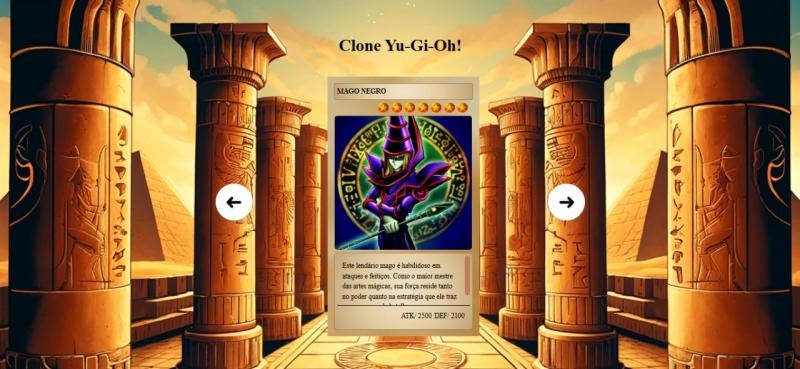

# Yu-Gi-Oh - Slider de Cartas 🃏

Este é um projeto clone inspirado no universo **Yu-Gi-Oh**, feito para treinar **HTML, CSS e JavaScript**.  
Ele exibe um **slider interativo de cartas**, onde o usuário pode navegar entre os personagens/carta usando botões de avançar e voltar.

---

## 🚀 Tecnologias utilizadas
- **HTML5**
- **CSS3**
- **JavaScript (Vanilla)**

---

## 🎮 Funcionalidades
- Navegar entre as cartas usando os botões de seta.
- Cada carta possui **nome, nível, imagem, descrição e atributos (ATK/DEF)**.
- Layout responsivo para se adaptar a diferentes tamanhos de tela.
- Imagens de fundo e cartas personalizadas do Yu-Gi-Oh.

---

## 📷 Demonstração
👉 [Acesse o projeto no GitHub Pages]([https://kaiquebz.github.io/clone-YuGiOh/](https://kaiquebz.github.io/clone-YuGiOh/)  



---

## 📂 Como executar
1. Clone este repositório:
   ```bash
   git clone https://github.com/KaiqueBz/clone-YuGiOh.git
